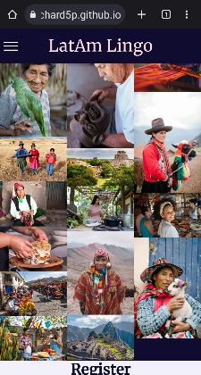

# LatAm Lingo.edu
Latin America Language and Culture School

LatAm Lingo is school of Latin American indigenous languages and cultures which seeks to educate their students with language and cultural skills for effective communication across Latin America.

The school founders are a group of indigenous and mestizaje friends who met at university and shared the same dismay about how little their classmates (and society in general) knew about the LatAm indigenous population. Beyond the professional desire for a profitable business is their societal goal of education and awareness about their native heritage. The government and NGO heritage organisations partially fund the start-up.

#Table of Contents

1. 

    
<a href="#ux">UX</a>

    <ul>
    <li>

    
<a href="#goals">Goals</a>

    - [Visitor Goals](#visitor-goals)
    - [Business Goals](#business-goals)
    - [User Stories](#user-stories)
    
</li>

    <li>

    
<a href="#visual-design">Visual Design</a>

    - [Wireframes](#wireframes)
    - [Fonts](#fonts)
    - [Icons](#icons)
    - [Colors](#colors)
    - [Images](#images)
    - [Styling](#styling)
    
</li>
    </ul>

2. 

    
<a href="#features">Features</a>

    <ul>
    <li>

    
<a href="#page-elements">Page Elements</a>

    - [Header](#header)
    - [Footer](#footer)
    - [About Page](#about-page)
    - [Gallery Page](#gallery-page)
    - [Register Page](#register-page)
    
</li>

    <li>

    
<a href="#feature-ideas">Feature Ideas</a>

    - [Functional](#functional)
    - [Technical](#technical)
    
</li>
    </ul>

3. 

    
<a href="#technologies-used">Technologies Used</a>

4. 

    
<a href="#testing">Testing</a>

    <ul>
    <li>

    
<a href="#methods">Methods</a>

    - [Validation](#validation)
    - [General Testing](#general-testing)
    - [Mobile Testing](#mobile-testing)
    - [Desktop Testing](#desktop-testing)
    
</li>

    <li>

    
<a href="#bugs">Bugs</a>

    - [Known Bugs](#known-bugs)
    
</li>
    </ul>

5. 

    
<a href="#deployment">Deployment</a>

    <li>

    
<a href="#github-deployment">Github Deployment</a>

    - [Github Preparation](#github-preparation)
    - [Github Instructions](#github-instructions)
    
</li>
    </ul>

6. 

    
<a href="#credit-and-contact">Credit and Contact</a>

    - [Content](#content)

# UX
## Goals
### Visitor Goals

The target audience for LatAm Lingo are:
- People who want to learn Mapudungun or Quechua.
- People who want to understand Latin American indiginous cultures.
- People who are interested in different cultures.
- People that may want to reconect with their heritage.
- People interested in working with indiginous colleagues.
- People interested in the exploring Latin America.
- People interested in Latin American history.

User goals are:
- Get an overview of school.
- Evaluate the authenticity of the site.
- Explore the various programs.
- Evaluate the potential benefits from the education.
- Register their interest.
- Enroll in a class.

LatAm Lingo fills these needs by:
- Providing a comprehensive desciption of the methodology, formats and options available.
- Opening with a reasuring image of native teachers and banner followed by a page detailing program qualifications.
- Providing a detailed description of each program.
- Gallery of pictures of places, events and cultures facilitated by education.
- Registration page.
- Program selection options on Registration page.

### Business Goals
LatAm Lingo's business goals extend beyond the professional desire for a profitable business. It includes their societal goal of education and awareness about their native heritage. Founded by a group of indigenous and mestizaje friends who met at university and shared the same dismay about how little their classmates (and society in general) knew about the LatAm indigenous population their primary objective is too keep their cultures alive and gain greater understanding. This has been made easier with the sposorship and support of both government and NGO heritage organisations.

Thus the a summary of business goals would be:
- Build awareness about indigenous cultures and their relevance today.
- Gain mailing list members.
- Inform potential clients about the educational services offered and increase class enrolment.
- Educate the general public about the history of LatAm languages (pre and post-colonisation) and the indigenous populations.
- Gain interest of potential clients and investors, and connect with social media.

### User Stories

1. As a user interested in indigenous culture I expect to find meaningful information.
0. I expect the qualifications first and foremost.
0. As a user interested in language, I expect to see:
    1. Languages taught.
    2. Qualifications earned.
0. As a user interested in different cultures, I expect to see:
    1. Information on the contents of a class.
    2. Identification of each culture offered in the program.
0. As a user, I expect to see:
    1. Information about the time commitment.
    2. Information about time schedules.
0. As a professional user (academic or business), I am interested in the availability of bespoke programs.

## Visual Design
### Wireframes
[Wireframes History](https://drive.google.com/drive/folders/1MC90lZssd6aURDya1wHe3fbtSQ6kODsg?usp=share_link)

### Icons
- Icons are taken from the [Fontawesome](https://fontawesome.com/) Free Icon library.
- Icons are utilised in the footer for social account icons and the "more below" arrow on the gallery page.

### Content

#### Fonts
Both fonts are downloaded from [Google Fonts](https://fonts.google.com)
-Headings: Eczar, Medium 500
-Body: Merriweather, Regular 400

#### Colors
Color base was chosen from a deep purple on in hero image using eyedropper.org. Purple is generally associated with education and the various shades generated by colormind.io provided a range of options. I then used color.adobe.com/create/color-wheel to find complementary and contrasting colors. The final selection was chosen using contrast-grid.eightshapes.com for WCAG 2.0 contrast grading as shown below: 
- #FFB1E5 (light purple) - text even, h/r text
- #0F0C30 (dark purple) - text odd, background even, h/f background
- #F1F0FB (very light purple) - background odd
- #FFFF00 (yellow) - text on hero with black shadow effect to add contrast

### Images
- The images are a mixure of places, personalities and events chosen to evoke feelings of engagement, curiosity and adventure about native Latin America. All made more accessible with knowledge of the indigenous languages and cultures. 
- Image sources:
    - Free
    -- .svg)
    -- 
    - Paid
    -- 

- Favicon 
    Generated from ![favicon-generator] (https://www.favicon-generator.org/) based on Globe from wikimedia

### Styling
The overall approach that I took to styling was clarity and consistancy. This included:
- Limited set of fonts and colors
-- High contrast on alternating pages
-- Distinct header and footer color schemes
-- Consistent use of page element styling

This approach carries over to the coding where the styling is organised for use.

# Features
## Page Elements
### Scrollable single page site
This site presents the user with a single page allowing giving them the option of:
- Scrolling through the site
- Navigating directly to a content section

### Landing Page
The Landing Page contains a large welcoming image of two native women in a school setting. The image, along with the accompanying text is meant to provide the user with immediate reasuring confirmation of LatAm Lingo's function and tone.

The image leaves room at the bottom of the page to show the top of the next section so that the user is encouraged to scroll down. In addition, the scrolling banner highlights some of the attributes of the program and ends with an down arrow to further indicate that there's more information below.

### Navigation Bar
This feature appears on all pages for consistency and ease of use.
- The navbar is fixed so it is visible no matter how far you scroll.
- The logo provides a link back to the home page at all times
- The Navbar is simple and provides clear access to the primary user goals and site features; Home, About, Gallery, Registration
-- This feature allows the user to easily navigate from page to page across all devices without having to revert back to the previous page via the ‘back’ button.
- On smaller devices the menu collapses to a drop down "hamburger"
-- Note: I decided to leave the "hamburger" open/close feature to be user enabled as I found it useful for switching between the registration and about when deciding on a selecting a class. Future design would include more choices and information on the registration screen.

 

 

### Footer
The footer contains links to social media platforms where LatAm Lingo has a presence, as well as the obligatory copyright. The particular social media sites shown were selected based on market research. 

In contrast to the header, the footer floats at the bottom of the website (the bottom of the html page). This is for two reasons:
1. The information provided is not essential to the user immediate goals
2. The space is better utilized, particularly on smaller viewports, for functional content

### About
This section contains all the content about the school and the programs. It is meant to provide the user with answers to decide if they will move to the next step of registration.
- Educational Approach
- Validity of Education
- Content of the Courses
- Format and duration of Courses
- Sales contact information

The section is structured with subsections 

### Gallery
- This section is purely for show and potentially provide a little extra enticement about new experiences that might be made possible with the language training.  To be honest, I don't think the gallery will significantly increase initial registration but may play a factor in avoiding buyers' remorse and gaining some general brand awareness.

### Register
- This page is a one-stop section for user registration with LatAm Lingo. There are three levels of interest that a user could register:
1. Add me to your mailing list. 
--Users who are interested in the school but not enrolling in any program currently can register their contact information and receive future emails.
--Users who enroll in a program are automatically added to the mailing list.
2. Enroll me in one or two (more in the future) group courses currently available.
3. Request an individual or bespoke group program.

All user entry occurs on this page and where the validation takes place.
- To facilitate the enrollment process and reduce the potential for user errors, most fields are chosen from lists rather than user entry. 
- User entry fields employ validation rules for:
--Type of data
--Range of values 

## Future Ideas
This site was developed with a limited set of technologies; html and CSS. In addtion, while the developer with familiar with coding, this was the first use of these technologies. Hence, the is ripe for feature enhancements which I could envisage but not include in this release. All future enhancements are focused on improving the user experience. Based on my experience, I would group them into funttional and technical improvements.

### Functional - These are UI improvements that could be made with the existing technologies.
- Reorganisation of registration by user community for clarity
- Improve user ability to sign up for a program and view its description simultaineously
- Improve responsiveness and flow with more advanced CSS features (such as Flex)
- Include a Spanish version of the site to attract more Latin American users

### Technical - These are UI improvements that could be gained from incorporating other technologies.

- Field selection from a larger and changing set of values. Benifits would be more effective multi-choice scrollable selections (as from a database)
- Multi-selection functionality using arrays

## Technologies Used

- Coding languages
    - html
    - css
    - Used type selectors instead of classes (before realising class is a higher level)
- Development environment
    - github
    - gitpod
    - MS Visual Studio
    
## Testing

- Testing was done througout the development process with increasing number and specificity as the project progressed. 
    1. Initial and frequent W3C html validation was done. 
    2. Validation rules were developed and documented as the fields were included.
    3. Once all the website features had all been included I designed a testing checklist which I completed periodically.
    4. The testing components and [final results have been documented here](./assets/docs/testing/test-results.md)

## Unfixed Bugs
- As noted in the testing document, the user is not returned to the same hero position when navigating to it from other sections. This was left as it did not significantly impact the user experience and, in the interest of delivery deadline, could be addressed in the next release.
- The original design included a checkbox for multiple group class selection.  This really needed a database and arrays so the current implementation has two rows, each with it's own id.

## Deployment
### Github Deployment
**Requirements:**
- A free GitHub account.

### Github Instructions
1. Log in to your GitHub account.
2. navigate to [https://github.com/Richard5P/LatAm-Lingo](https://github.com/Richard5P/LatAm-Lingo).
3. You can set up your own repository and copy or clone it, or you fork the repository.
4. `git add`, `git commit` and `git push` to a GitHub repository, if necessary.
5. GitHub pages will update from the master branch by default.
6. Go to the **Settings** page of the repository.
7. Scroll down to the **Github Pages** section.
8. Select the Master Branch as the source and **Confirm** the selection.
9. Wait a minute or two and it should be live for viewing. See my own [here](https://richard5p.github.io/LatAm-Lingo/).

## Credits and Contact
### Content
- Responsive Nav inspired by Kevin Powell https://www.youtube.com/watch?v=8QKOaTYvYUA&ab_channel=KevinPowell
- Animated text inspired by Creative Rafikaul https://www.youtube.com/@CreativeRafikul
- StackOverflow

Any code utilised from a site is documented and credited within the code.
No credit is required for the other media other than provided by source.

### Contact
Please feel free to contact me at `richard.deutsch@gmail.com`

